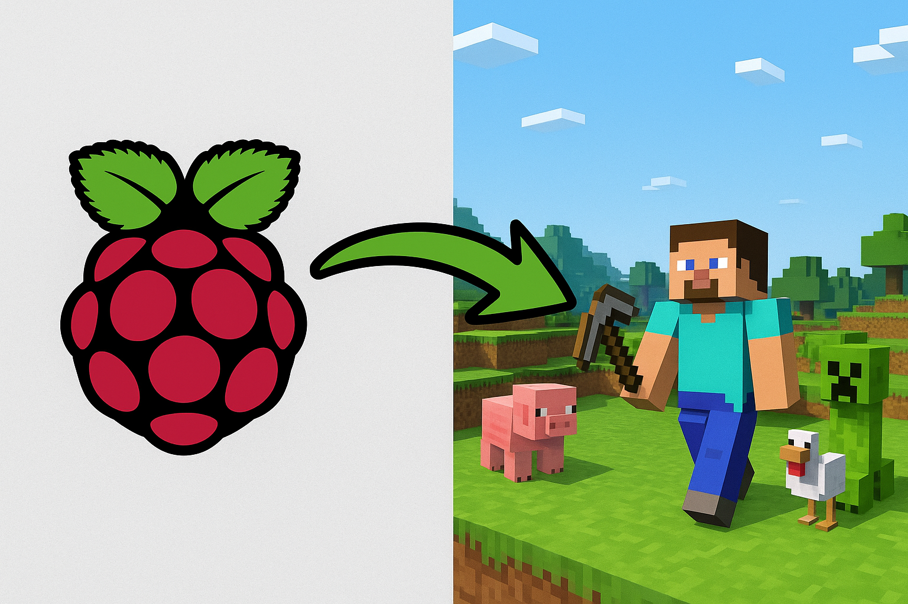
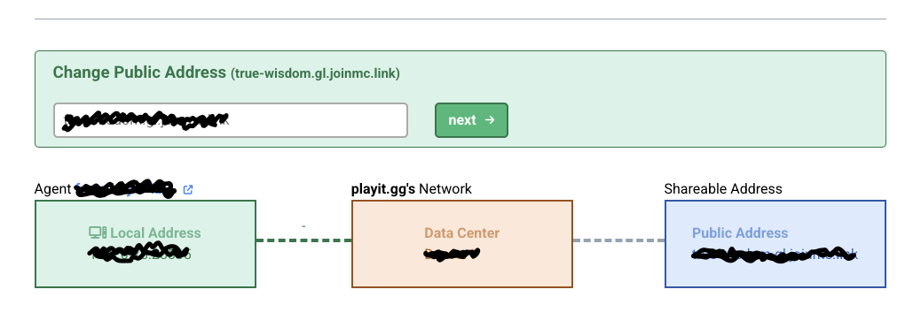

# Raspberry Pi Minecraft Server Setup 

When I first got my Raspberrypi 5 16GB RAM (major overkill), I decided the first thing I would do is self host a Minecraft server so I could make friends... it hasn't worked.

It was a total pain to go through all the system set up & commands, espcially trying to set port forwarding. So, I made this repo so that you don't have to be sad like me. 👍

This repo provides everything you need to run a modern Minecraft Java server (1.21.8) on a 64-bit Raspberry Pi OS, complete with automated installation, tunneling, and systemd service management.



## Features
- **Automated Installation**: Scripts to install Java 21 from Terarium, Minecraft server files, tmux, Playit agent, and more.
- **Easy Server Management**: Start, stop, and manage your server with systemd and tmux.
- **Public Access**: Use Playit for free, secure tunneling to expose your server to the internet.
- **Dynamic Configuration**: Service files and scripts auto-detect your username and environment.

## Quick Start
1. **Clone the repo**
   ```bash
   git clone https://github.com/noah-andersen/raspberrypi-minecraft-server.git
   cd raspberrypi-minecraft-server
   ```
2. **Run the install script**
   ```bash
   ./installs.sh
   ```
3. **Sign up for free playit agent**
   ```bash
   ./playit-linux-aarch64
   ```

   * This will provide you with a link to go to and sign up.
   * Select Minecraft Java Service, copy over the code it generated for you, and then register your IP.

   


4. **Set up the systemd service**
   ```bash
   ./systemd.sh
   ```
5. **Start playing!**
   Your server will be running in the background and **accessible via the domain name that playit provides you**.

6. **Attach to the Tmux Window to Access Minecraft Console for Commands**
   ```bash
   ./console.sh
   ```

## File Overview
- `installs.sh` – Installs all dependencies and sets up the Minecraft server directory.
- `systemd.sh` – Generates and enables a systemd service for automatic server management.
- `utils/start.sh` – Launches the Minecraft server and Playit agent in tmux panes for easy control.
- `utils/console.sh` - Attach to the tmux window to access the minecraft console

## Requirements
- Raspberry Pi (64-bit OS recommended)
- Internet connection
- Sudo privileges

## Playit Agent
Playit lets you tunnel your server to the public internet for free. Sign up at [playit.gg](https://playit.gg) and follow the prompts when you first run the agent.

---

**No Raspberrys were harmed in making this**
